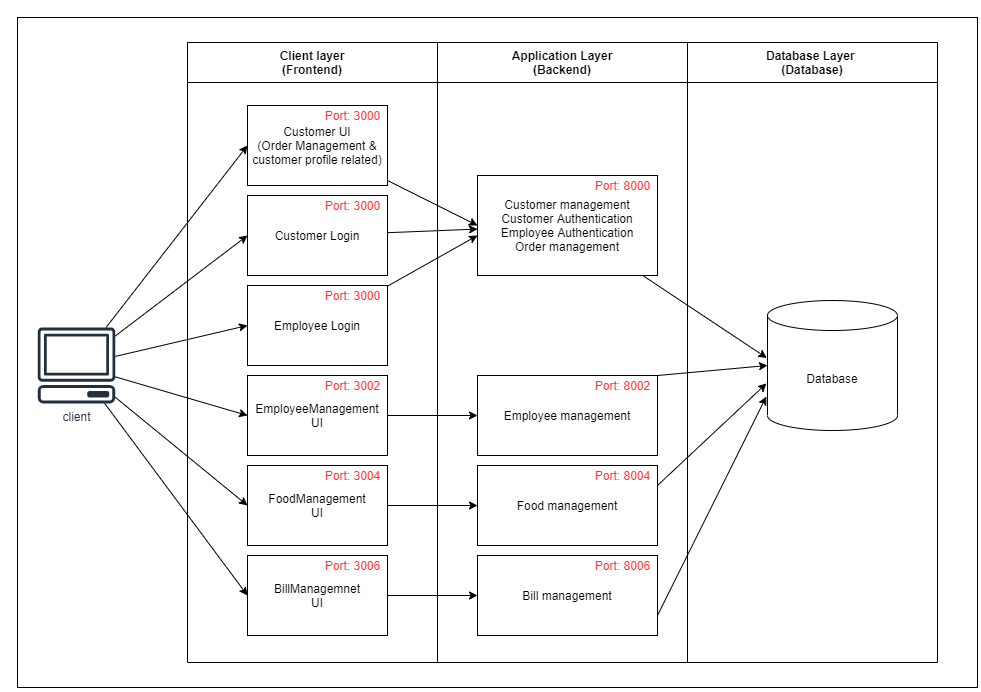

# NoQueues

- Development Tech Stack - MERN (MongoDB, Express, React, Node)
  
---

- Installation process
  
1. Install dependencies of all services.
2. Run all 4 services.

---

- Things to consider
  
1. examine the architecture of the system

